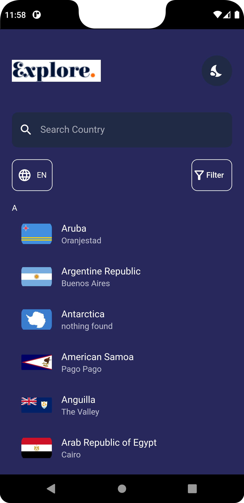
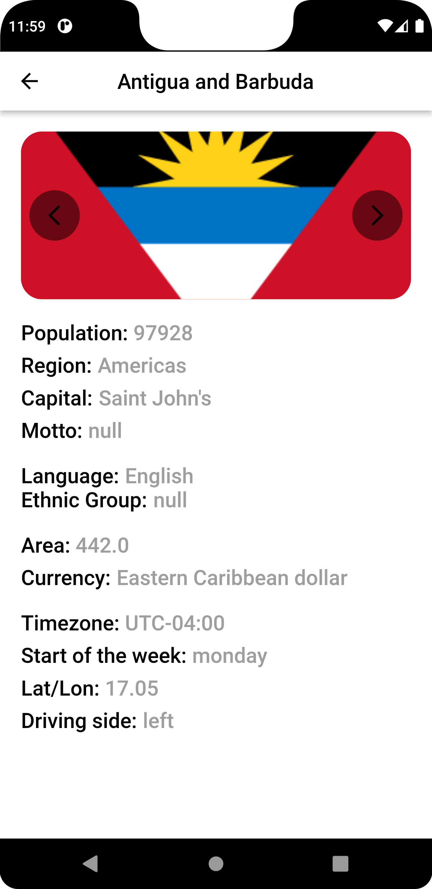
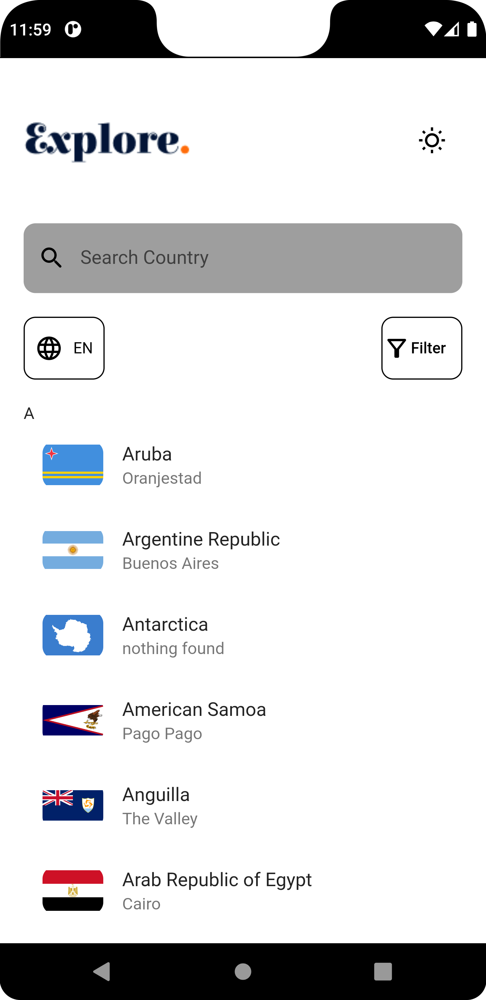

# country_list

A new Flutter project.

## Getting Started

Description: 

The app was built using flutter.
The app shows a List of different countries,capital and there details.
Search Functionality was implemented on the app in which you can filter through different regions and time zones.
Orderly arrangement of the list of countries in alphabetical order.

Code Base:
The code base was written with dart programming language.
The Design architecture used in this project is MMVC(Model,Views and controllers).
This project is a starting point for a Flutter application.

LIBS
provider:The provider package was used to provides a state management technique that is used for managing a piece of data around the app.

FEATURES TO BE ADDED:
MAps of the different.

CHALLENGES:
challenges on how to implement the search and filter functionality.
challenges on how to implement the translation functionality from the API.
Difficulty in tapping into the properties of of the API.

-
-
-

- [LinkedIn Profile](https://www.linkedin.com/in/simon-singlad-chuwkwu-915115244/)
- [Github](https://www.github.com/devsinglad)
- [Email](simonsinglad5@gmail.com)

- [Lab: Write your first Flutter app](https://docs.flutter.dev/get-started/codelab)
- [Cookbook: Useful Flutter samples](https://docs.flutter.dev/cookbook)

For help getting started with Flutter development, view the
[online documentation](https://docs.flutter.dev/), which offers tutorials,
samples, guidance on mobile development, and a full API reference.
